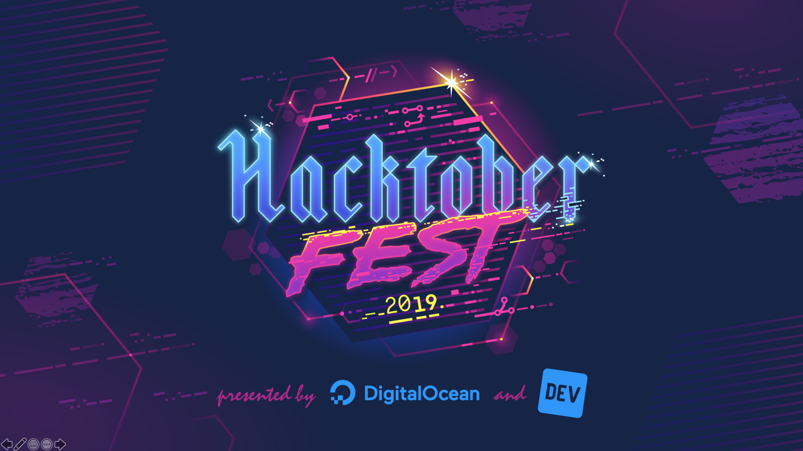

theme: Simple, 2

^
1 - What is OSS/Hacktoberfest?
2 - How to get involved?
3 - MonSec - Vulns/Disclosure
4 - Demo with example PR

---

# [fit] What is Hacktoberfest?

^ month long in October
^ Digital Ocean and Practical DEV
^ promotes contributions to open source software
^ 4 acceptable PRs earns a free shirt

---

# [fit] What is open source?

_"Open Source software is software that can be freely accessed, used, changed, and shared (in modified or unmodified form) by anyone"_

\- Open Source Initiative

^ Source code is public
^ Can be modified and distributed within license

---

# [fit] Where do I get started?

Our Hacktoberfest site has a [collection of resources](https://nchlswhttkr.github.io/hacktoberfest-2019/about) to help you find projects to contribute to

---

# [fit] Anatomy of a project

You've found a project, what do you do next?

Let's take a look at an [example](https://github.com/facebook/react) or [two](https://github.com/freeCodeCamp/freeCodeCamp)

^
monorepo
automated processes
licensing
contributing documentation/agreements
development practices/style guide

---

# [fit] Why choose open source?

- Users can modify and redistribute your programs
- Can be audited, inspected
- Can **accept contributions** from a wider community

^
freedom

---

# [fit] So you found a vulnerability

## What do you do now?

---

# [fit] Blackmail :scream:

^
not worth legal
we're good people, right?

---

# [fit] Fix it yourself :innocent:

^
proprietary/source unavailable
too complex

---

# [fit] Disclose it :sunglasses:

## Contact maintainers privately

## Report to security team at company

^
bounty
large entities have dedicated teams
apple \$1M for kernel remote w/o user interaction

---

# [fit] How does disclosure work?

^
in particular, OSS projects

---

# [fit] Is open source software less secure?

## Well yes, but actually no

## It's a tradeoff

^
inherently more vulnerable than closed/proprietary
public code usually has more services (GH - Dependabot, Semmle) for free
https://twitter.com/nchlswhttkr/status/1146991983132459009/photo/1
token revocation is now a service (partnerships)

---

# [fit] A final message

Hacktoberfest is about making **meaningful contributions** that better **the community**.

Be **kind and welcoming**, this is about the **open source community**.

^
constructive

---

# [fit] Ready to get contributing?

Record your participation in the [event repo](https://github.com/nchlswhttkr/hacktoberfest-2019)!

---

# https://github.com/nchlswhttkr/hacktoberfest-2019
